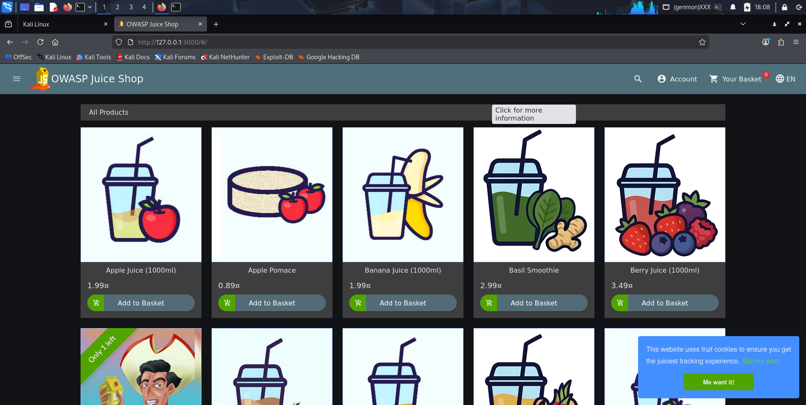
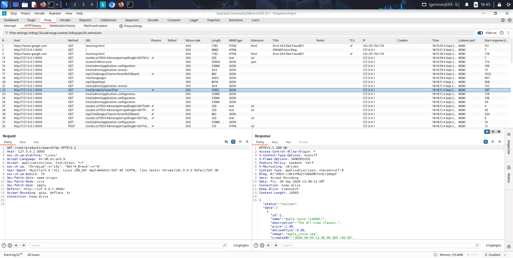
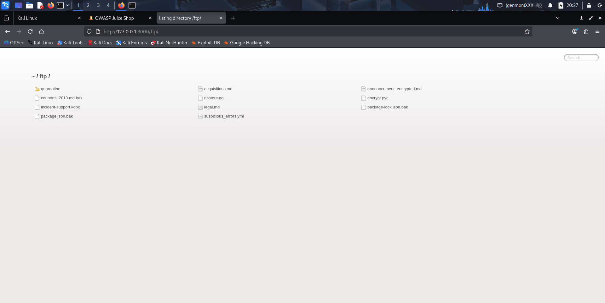

# OWASP Juice Shop Security Assessment Lab

## Overview

A controlled web-application security assessment performed against a self-hosted OWASP Juice Shop instance. The project demonstrates security reconnaissance, HTTP request analysis, response-header review, and documentation of an identified directory-listing exposure.

## Scope

- **Target:** `http://127.0.0.1:3000`
- **Application:** OWASP Juice Shop
- **Environment:** Local Docker container on Kali Linux
- **Authorization:** Self-hosted, intentionally vulnerable training application only

## Objectives

- Understand how to define an authorized web-security assessment scope.
- Intercept and inspect web traffic using Burp Suite.
- Review application response headers.
- Discover publicly exposed routes through passive reconnaissance.
- Document findings, risk, evidence, and remediation.

## Tools Used

- Kali Linux
- Docker
- OWASP Juice Shop
- Burp Suite Community Edition
- curl

## Methodology

1. Created and documented a local, authorized testing scope.
2. Launched OWASP Juice Shop in a Docker container bound only to `127.0.0.1`.
3. Used Burp Suite’s built-in browser to intercept and inspect normal application traffic.
4. Reviewed HTTP response headers with curl.
5. Checked the publicly available `robots.txt` file for route-discovery information.
6. Verified the accessibility of the discovered `/ftp/` route.
7. Recorded findings and recommended remediation.

## Key Finding

### Public Directory Listing Exposure — Medium Severity

The application’s public `robots.txt` file referenced the `/ftp/` path. The path returned `HTTP 200 OK` and displayed a directory listing without authentication.

**Risk:** Public directory listings can expose file names and potentially sensitive resources, increasing the application’s attack surface.

**Recommendation:** Disable directory listing, keep non-public files outside web-accessible directories, and enforce authentication and authorization where appropriate.

See [findings.md](findings.md) for full evidence and analysis.

## Screenshots

### Juice Shop Local Lab

### Burp Suite HTTP History

### Public Directory Listing

## Skills Demonstrated

Web application reconnaissance, VAPT fundamentals, Burp Suite traffic interception, HTTP request and response analysis, security-header review, route discovery, security reporting, Docker, and Kali Linux.

## Disclaimer

This project was performed exclusively against a self-hosted OWASP Juice Shop instance for educational purposes. No external, production, or unauthorized system was tested.
